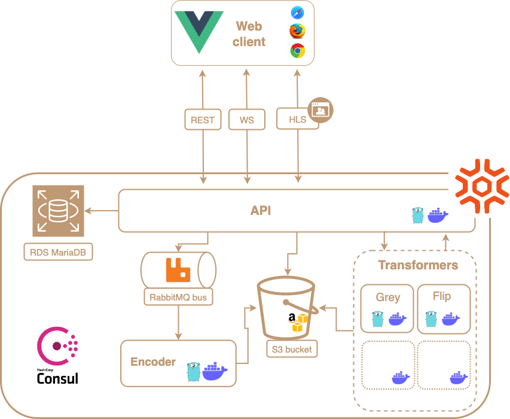

[](https://github.com/sogilis/Voogle/actions/workflows/CI-CD.yml)

# Voogle

Voogle is an open source project, maintained by [Sogilis](https://sogilis.com/), that implements good pratices in cloud native application development, with a high degree of cybersecurity requirements.

For now, Voogle consists in a micro-service broadcasting and sharing video streams application. It is also used as a demonstration medium for the [SquareScale platform](https://www.squarescale.com/).

## Architecture overview


## Needed tools

- Docker
- Docker Compose
- Makefile
- Act `0.2.25` [Github action local](https://github.com/nektos/act)
- protoc `libprotoc 3.12.4`
- git-lfs

- Go `1.18`
- Golangci-lint `1.29`(https://github.com/golangci/golangci-lint-action)

- Node `16.13.1`
- Npm `8.3.0`

## How to run the environment locally

To start Voogle on your machine, you need services (for now): webapp, api, encoder, gray-server-transformer, flip-server-transformer, a S3-like, a Rabbitmq and a Mariadb.

You don't have to set manually `S3_HOST` unless you know what you are doing.

- Before starting Voogle with the Docker Compose, a .env is necessary. You can either fill one by hand based on the `.env.template` file or use the `make generate-env-file` command.
- You can start all backend services with `make start_all_services`.
- S3-like (MinIO), Rabbitmq and Mariadb will be launched first following `docker-compose-external.yml` file
- MinIO that is a service that have the same API as S3.
  The API will be available on the port `9000` and the console one the port `9001`.
- The Rabbitmq server will be available on the port `5672` and the console one the port `15672`.
- Mariadb can be accessed using docker with command `exec -it <mariadb_container_id> mysql -u root -p`
- API, encoder, gray-server-transformer and flip-server-transformer will then be launched following `docker-compose-internal.yml` file.
- Observability (grafana, prometheus, node exporter) are available, you can start all services and observability with `make start_all_services_and_observability`
- Finally, you can start the webapp (`/src/webapp`) with `npm run serve` to start the VueJS development server.
- Credentials for Voogle account can be found in the `.env` file as USER_AUTH and PWD_AUTH environment variables.
- All credentials for MinIO, Rabbitmq and Mariadb can be found in the `.env` file.
- Note that you can launch only external services (means S3-like (MinIO), Rabbitmq and Mariadb) with `make start_external_services`. Then, you can launch each internal services (means API, encoder, gray-server-transformer, flip-server-transformer) from `src/` with the `make run-dev-<service_name>` (example: `make run-dev-api`).
- All running services can be stopped and cleaned up with `make stop_services`

## Observability
- Prometheus logs are available at http://localhost:9090/metrics
- Grafana graphs are available at http://localhost:3000

## How to install protobuf generator

- Debian/Ubuntu: `apt install protobuf-compiler`
- Fedora: `dnf install protoc-gen-go`

## Doc API file (Swagger/Openapi)

### Install tool

- `go get -u github.com/swaggo/swag/cmd/swag`
- `go get -u github.com/swaggo/http-swagger`
- `go get -u github.com/alecthomas/template`

### Generate doc

- `cd src/cmd/api/`
- `swag init -g main.go` or `make generate-docs`

We use GitHub Pages to display our documentation. Before merging, please rebase on main and ensure the files are up to date using the above commands.
Once the merge request is accepted, you can access https://sogilis.github.io/Voogle/ to check the documentation.

## Visual Studio Code

### Configuration for multi-module workspaces

- `.vscode/setting.json`
  ```json
  {
    "go.useLanguageServer": true,
    "gopls": {
      "experimentalWorkspaceModule": true
    }
  }
  ```
