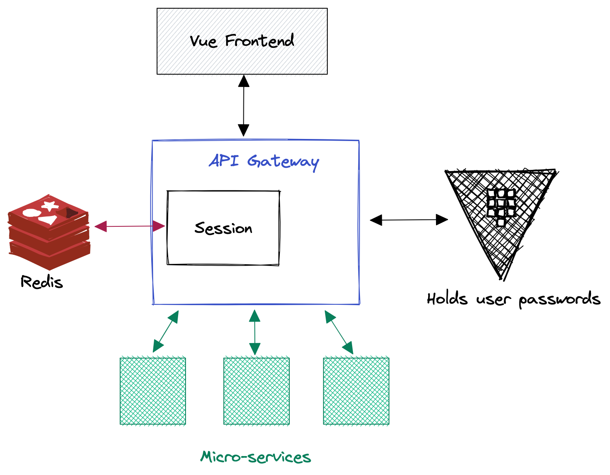

# Authentication in Voogle
This record describes the authentication mechanism proposed for Voogle.

## Context
Users in Voogle need to authenticate themselves at some points, so they certify that they have access to the appropriate service.

## Overview of the solution
For pedagical purpose, at first place, we choose to implement an authentication mechasnim base on the principle described below :

1. The authentication is handled by the API gateway, which acts as a frontend service for all others. In other words, all other services don't need to implement authentication.
2. Authentication is password based and passwords are stored within a Vault instance.
3. Sessions will be used, so that password do not need to be checked at each API call. We propose to use [gorilla/session](https://pkg.go.dev/github.com/gorilla/sessions) as a library support for sessions.

## API Gateway
The API gateway is, among other things, centralizes authentication for all services. It means that each request goes trhough the API gateway before reaching any other Voogle service.

## Session
The authentication session uses a session cookie (shared secret between client and server) taht allows to authenticate rapidly, withtout verifying the user's password (and thus, without querying the vault service for password checking).

## Password storage
### Vault K/V store
The Vault secret engines holds any secrets used for the authentication protocol of Voogle. These secrets are: 1) users' password and 2) the derivation key used by the API Gateway to match user ids from the database to vault.

### Derivation key
