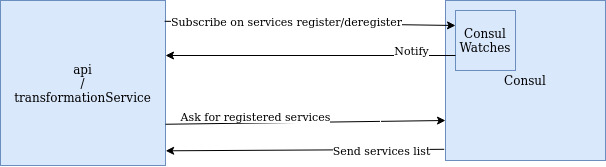

## Service Discovery

### Consul API
We use consul for transformation services discovery. Using the consul SDK, we are able to fetch registered services with advanced queries with filters. So we can request Consul to fetch transformations services instances using prefix/suffix in service name, or better, using tags.
See [Consul SDK](https://pkg.go.dev/github.com/hashicorp/consul/api) and [Consul agent API](https://www.consul.io/api-docs/agent/service).

### Local cache
To avoid multiple and useless consul requests (one for each video transformation request), we implement a cache to save transformation services addresses. Then, we need a means to update this cache to always be up to date with available tranformations services. Note that each service (api, and transformation) instance maintains their own cache.

### Consul Watches
Consul gives the possibility to execute a handler when an update is detected thanks to ["Watches"](https://www.consul.io/docs/dynamic-app-config/watches). We use it to be notify when a service is register/deregister and then update the local cache.

